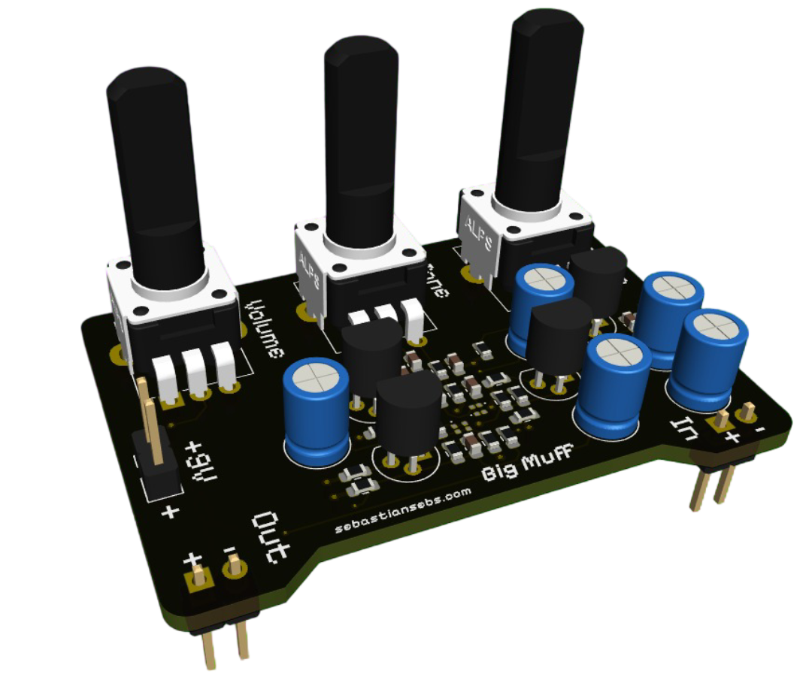
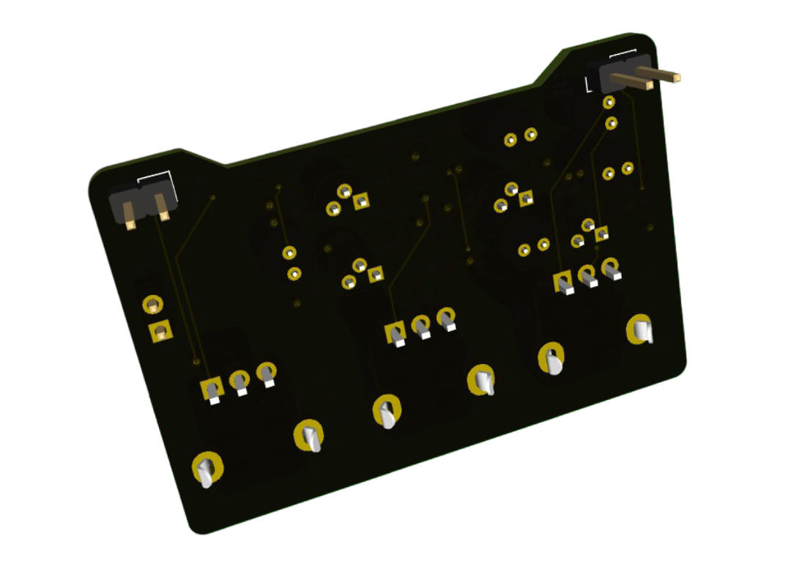
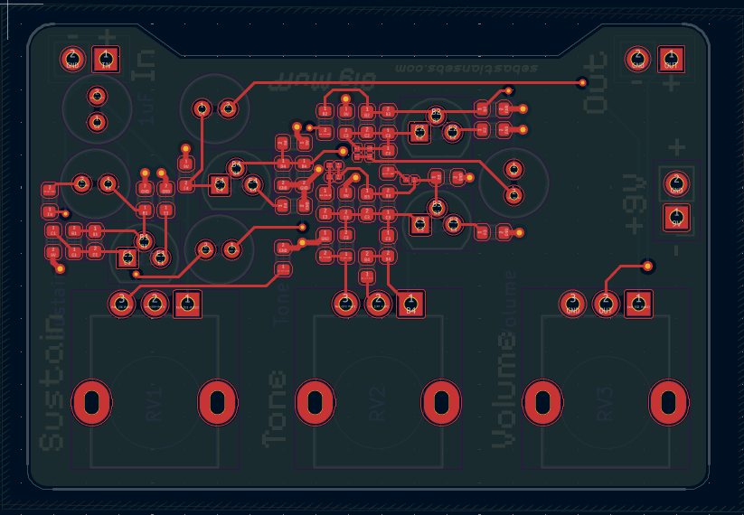
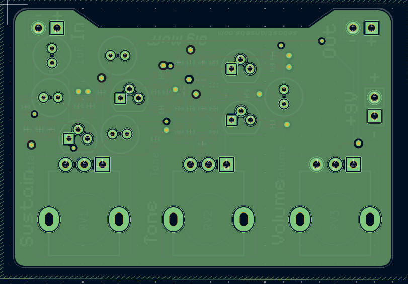
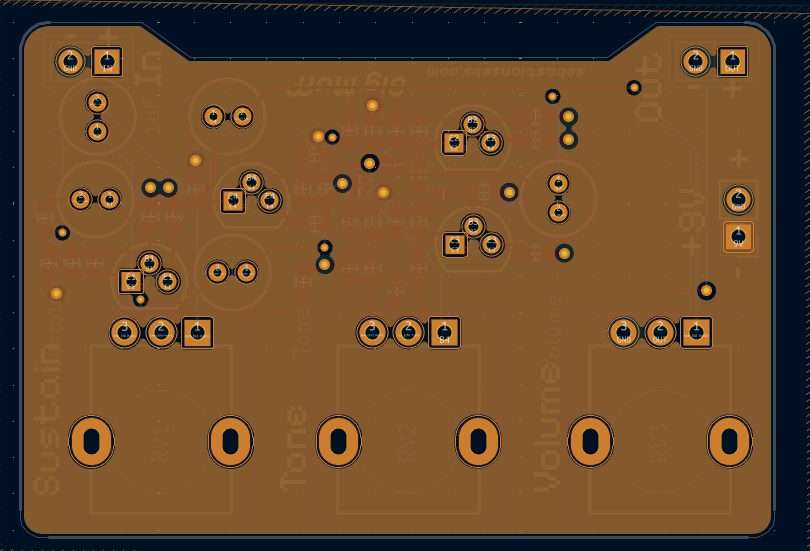
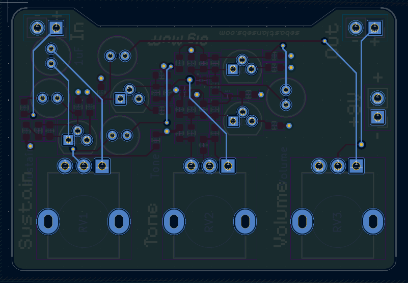

# Big Muff from Scratch

    <a href="https://www.sebastiansebs.com/BigMuff/BigMuff.pdf">📄 View Schematic PDF</a>

## Overview

This project describes a custom-designed **Big Muff** guitar effects pedal, built using discrete components. This four-stage analog circuit provides powerful signal amplification, harmonic distortion, and tone shaping capabilities.

The circuit features four **NPN 2N2222 transistors** configured in distinct stages: an input buffer, two gain/clipping stages, a passive tone control section, and an output buffer with volume control. The design incorporates silicon diodes for controlled signal clipping and a comprehensive network of resistors and capacitors for optimal signal processing and tone shaping.

    
    
Figure 1: Front view of the PCB

    
    
Figure 2: Back view of the PCB

## Project Architecture

The project is structured hierarchically within KiCad, with the following key sections:

1.  **Root:** The top-level schematic, connecting the main circuit blocks.
2.  **Project Architecture:** Defines the overall system architecture and contains the complete Big Muff circuit.
    - **Input Buffer Stage (Q1):** High-impedance input for guitar signal
    - **First Gain/Clipping Stage (Q2):** Primary amplification and distortion
    - **Second Gain/Clipping Stage (Q3):** Additional gain and harmonic saturation
    - **Tone Control:** Passive filter network for frequency shaping
    - **Output Buffer Stage (Q4):** Final amplification and volume control

## Circuit Analysis

Based on the schematic, here's a breakdown of each section of the Big Muff circuit:

### Section 1: Input Buffer / Pre-Amplifier (Q1)

**Function:** This stage acts as a high-impedance input buffer and pre-amplifier. The large input resistors help present a high input impedance to the guitar signal, preventing loading of the guitar's pickups. Q1 amplifies the incoming signal while the supporting network provides frequency shaping and stability.

### Section 2.1: First Gain/Clipping Stage (Q2)

**Function:** This is a key gain and clipping stage. Q2 provides significant amplification, and the diodes D1 and D2 are placed in a feedback configuration to clip the amplified signal when it reaches a certain voltage threshold, producing the characteristic Big Muff distortion and sustain.

### Section 2.2: Second Gain/Clipping Stage (Q3)

**Function:** This stage provides further amplification and clipping. The signal from Q2 is fed into Q3, which amplifies it even more. Diodes D3 and D4 perform another round of signal clipping, contributing to the heavy, saturated distortion sound characteristic of the Big Muff.

### Section 3: Tone Control (Passive Network)

**Function:** This is the passive "Tone" control section, a hallmark of the Big Muff. It's a variable filter that allows you to sweep between more bass-heavy (less treble) and more treble-heavy (less bass) sounds. The specific capacitor values determine the frequencies affected by the tone control.

### Section 4: Output Buffer / Volume Control (Q4)

**Function:** This final stage acts as an output buffer and incorporates the master volume control. Q4 provides a final stage of amplification and buffering to drive the output effectively. The volume control allows adjustment of the overall loudness of the distorted signal before it leaves the pedal.

## PCB Layers

The PCB is meticulously designed with the following **4 layers** to optimize **signal integrity**, **power delivery networks**, and **component density**, ensuring robust performance and manufacturability:

1.  **Layer Top (F.Cu - Front Copper):**

    - **Description:** This is the primary **component placement layer**, accommodating **Surface Mount Devices (SMDs)** and **through-hole components**. It's strategically utilized for **critical signal routing**, **component interconnections**, and minimizing trace lengths for optimal **signal integrity**.

    
    
Figure 3: Top copper layer showing component placement and primary routing

2.  **Power Layer (In1.Cu - Inner Copper 1):**

    - **Description:** A dedicated **internal power plane** for the **+9V rail**. This continuous copper plane ensures **low-impedance power distribution**, minimizing **voltage ripple** and providing a stable current source across the entire board, critical for **power integrity** of the analog circuitry.

    
    
Figure 4: Internal power plane for stable 9V power delivery network

3.  **Ground Layer (In2.Cu - Inner Copper 2):**

    - **Description:** A comprehensive **internal ground plane**. This solid plane serves as a universal **low-impedance return path** for all signals, significantly reducing **electromagnetic interference (EMI)**, enhancing **electromagnetic compatibility (EMC)**, and providing effective **shielding** for sensitive audio traces.

    
    
Figure 5: Internal ground plane serving as robust ground reference and EMI shield

4.  **Layer Bottom (B.Cu - Bottom Copper):**

    - **Description:** Utilized for completing **signal routing**, particularly for connections requiring longer runs or bypassing components. This layer also provides flexibility for **additional component placement** and routing optimization.

    
    
Figure 6: Bottom copper layer showing secondary routing and connections

## Key Components

- **Q1, Q2, Q3, Q4:** 2N2222 NPN Transistors (TO-18 or TO-92 package)
- **D1, D2, D3, D4:** 1N914 Silicon Diodes for signal clipping
- **Various Resistors:** Carbon film or metal film for bias, load, and feedback
- **Capacitors:** Mix of electrolytic, film, and ceramic types for different functions
- **Potentiometers:** Volume and Tone controls (typically 100kΩ)
- **Input/Output Jacks:** 1/4" mono jacks for guitar input and amplifier output

## Capacitor Types and Applications

### For Larger Capacitance Values (e.g., 1μF):

We typically utilize **electrolytic capacitors**. These are commonly used for coupling between stages and for power supply filtering due to their high capacitance in a relatively small form factor. **Important:** Electrolytic capacitors are **polarized**, meaning they must be installed with the correct orientation (positive lead to higher voltage, negative lead to lower voltage/ground) to prevent damage.

### For Smaller Capacitance Values (e.g., 470pF, 0.1μF, 0.0015μF, 0.015μF):

**Film capacitors** (such as polyester or metallized polypropylene) or **ceramic capacitors** (like multilayer ceramic capacitors - MLCCs) are generally preferred. These are excellent for tone shaping, filtering, and high-frequency bypassing due to their stability, low noise, and **non-polarized** nature, meaning their orientation in the circuit does not matter.

### Capacitor Footprint: Capacitor_THT:C_Radial_D5.0mm_H7.0mm_P2.00mm

This designation refers to a **Through-Hole Technology (THT) Radial Capacitor** with the following specifications:

- **THT:** Through-hole mounting (leads pass through PCB holes)
- **Radial:** Both leads emerge from the same end of the capacitor
- **D5.0mm:** Body diameter of 5.0 millimeters
- **H7.0mm:** Body height of 7.0 millimeters
- **P2.00mm:** Pin pitch of 2.00 millimeters between lead centers

This footprint size is commonly used for small electrolytic capacitors or film/ceramic capacitors in audio circuits, depending on the required capacitance and voltage rating.

## Important Files

- `Big Muff.kicad_pro`: KiCad project file
- `Big Muff.kicad_sch`: Top-level schematic
- `Project Architecture.kicad_sch`: Complete circuit schematic
- `Revision History.kicad_sch`: Project revision tracking
- `Big Muff.kicad_pcb`: PCB layout file
- `Big Muff.kicad_dru`: PCB design rules file
- `Big Muff.kicad_prl`: Project-specific library settings
- `Schematic/BigMuff.pdf`: Complete schematic in PDF format

## Design Features

- **Four-stage analog signal processing**
- **Symmetrical diode clipping for rich harmonic distortion**
- **Passive tone control for frequency shaping**
- **High input impedance for guitar compatibility**
- **Low output impedance for driving amplifiers**
- **Through-hole components for easy assembly and modification**
- **Four-layer PCB design for optimal signal integrity**
- **Professional PCB layout with proper grounding and power distribution**

This Big Muff implementation provides the classic thick, creamy distortion that has made this circuit a favorite among guitarists for decades, while using modern PCB design practices for reliable performance and easy construction.
